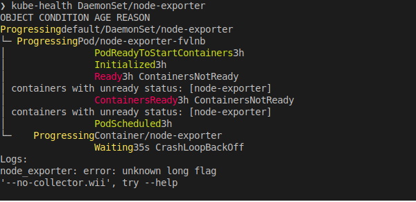
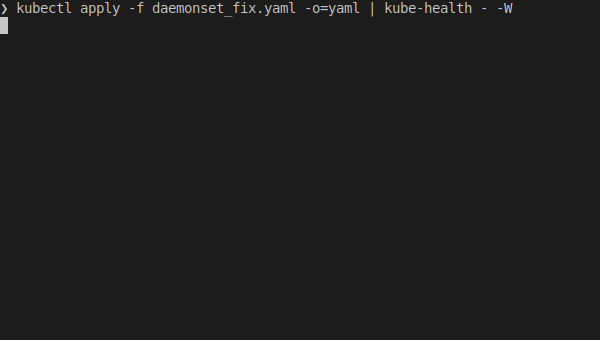

# kube-health

`kube-health` is a library and a kubectl plugin to evaluate the health of
Kubernetes resources. It aims at unifying and making it easier to understand the
health of individual objects without requiring to know all the nuances of
different kinds.

## Features:

* Unified health reporting of Kubernetes resources.
* Decomposing the health of a high-level object (e.g. deployment) to lower-level components (e.g. pods and containers) for faster root cause analysis.
* Wait for reconciliation.
* Differentiating between progressing and stalled status.
* Combine the command with others, e.g. `kubectl apply`.
* Use via CLI or as a library.
* Extensibility for implementing non-standard health evaluation logic.

## CLI Usage

The most basic use is simply asking about the status of a particular object.

``` sh
kube-health <object-type>/<object-name>
```



Besides the health of the object itself, it shows the details from sub-resources
(including tail of logs of the failed container in this case).

By default, the sub-resources are only displayed for objects in abnormal state. Use `-H`
to show details for objects with healthy (OK) status as well.

It's possible to combine `kube-health` with `kubectl apply` via a pipe:

``` sh
kubectl apply -f <manifest-file> -o=yaml | kube-health -
```

`kube-health` allows waiting for reconciliation via additional flags.



There are multiple waiting strategies implemented:

- `--wait-progress|-W` - wait while there is are some objects still progressing
(regardless of the final result).
- `--wait-ready|-R` - wait until all the objects are in OK state
- `--wait-forever|-F` - continuously poll for the status regardless of the results.

### Exit codes

- `0` - all resources are `OK`
- `1` - some resources in `Warning` state
- `2` - some resources in `Error` state
- `3` - some resources in `Unknown` state
- `128` - error during evaluation

If some resources are progressing, `8` is added to the exit code: use bitwise
AND to extract this information.

## Installation

* Binaries for Linux, Windows and Mac are available as tarballs in the [release](https://github.com/inecas/kube-health/releases) page.
* Using `go install`:

   ```shell
   go install github.com/inecas/kube-health@latest
   ```

## Library Usage

Besides just using kube-health from command line, it is possible to
leverage the functionality on the server side as well, e.g. exporting resources
health via monitoring stack. Example TBD.

## Motivation

Kubernetes ecosystem encourages use of [certain
conventions](https://github.com/kubernetes/community/blob/master/contributors/devel/sig-architecture/api-conventions.md#typical-status-properties)
when reporting status of the objects. One of the core units of the status is the
`condition`. Unfortunately, in some cases the condition is desired to be `True`
(e.g. `Ready`), while it's `False` for others (e.g. `OutOfSpace` or `Degraded`).

With the concept of eventual consistency, it's also important to be able to
quickly tell whether the abnormal state is still expected to change or it's
stuck and needs manual intervention.

Another common case is an object composed by some lower-level components. There are
some conventions here as well (e.g. using `ownerReference`) for capturing this relations.

This project tries to leverage available conventions and cover the common cases
to build better user experience around objects status reporting. The main idea could be summarized with:
1. if a resource follows common practices, it should work out of box.
2. if it doesn't, it's still possible to extend `kube-health` to support it (and
   ideally enhance the resource's API to follow the conventions.)

## Project Status

The project should be far enough to be usable out-of-the-box. It's however
still in early stage of development and the APIs should not be considered
stable yet.

## Prior Art

These projects played an important role during the development of kube-health:

- [kubernetes-sigs/cli-utils](https://github.com/kubernetes-sigs/cli-utils/tree/master) 
- [ahmetb/kubectl-tree](https://github.com/ahmetb/kubectl-tree)
- [tohjustin/kube-lineage](https://github.com/tohjustin/kube-lineage)
- [ahmetb/kubectl-cond](https://github.com/ahmetb/kubectl-cond)
- [bergerx/kubectl-status](https://github.com/bergerx/kubectl-status)

## Developer Docs

For more details on structure of the code and developer guides, see [the developer docs](./docs/dev.md).
